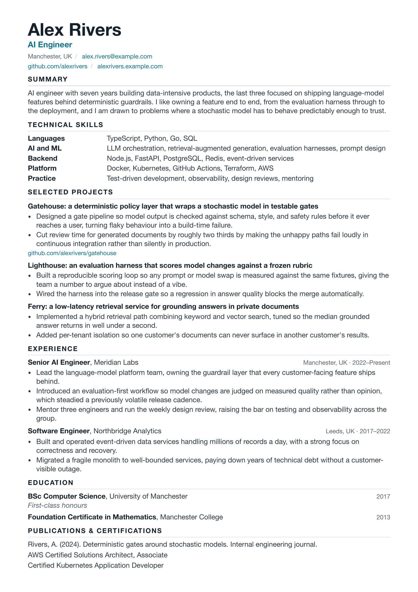

# tailored

**The model proposes; the gates decide.**

`tailored` turns a candidate's structured facts into a tailored CV and cover note
for a specific role. A stochastic language model writes the prose. A set of
deterministic gates stands between that prose and the document you send, so the
output is testable, repeatable, and free of the tells that give machine writing
away.

It ships as two things: a small TypeScript toolkit with a `tailored` CLI, and a
Claude Code skill that orchestrates the loop and calls the gates.

## The idea

A language model is a wonderful drafting tool and a terrible final authority. Left
alone it drifts: it invents an employer, it pads a date, it reaches for an em dash,
it lets a confidential project name slip into the prose. The fix is not a better
prompt. The fix is to wrap the stochastic component in deterministic checks that
fail the build, the same way a type checker wraps a dynamic language or a load
combination bounds a structural design. The model is free to be creative inside an
envelope it cannot leave.

This is an interlock for documents: a gate that lets good output through and stops
the rest, by construction rather than by hope.

## The gates

| Gate | What it enforces | Determinism |
| --- | --- | --- |
| schema | the candidate's `canon.yaml` is well formed | deterministic, exits non-zero on failure |
| ai-tell | no em dashes, no double-hyphen connectors, no HTML em-dash entities | deterministic |
| page-fit | the document fits its page budget | deterministic, via poppler |
| ip-guard | no protected topic leaks into the output | deterministic |
| visual | the document actually looks right | agent in the loop, read the preview |

Four of the five gates pass or fail with an exit code, so continuous integration
and the skill can both gate on them. The fifth is honest about its nature: judging
whether a page looks right is a job for a human or an agent reading the rendered
preview, not for a regular expression. We do not pretend otherwise.

## Install

```sh
git clone https://github.com/farshadpasbani/tailored
cd tailored
npm install
npm run build
npm test
```

To use the Claude Code skill, copy the `skill/` directory into your skills folder:

```sh
cp -r skill ~/.claude/skills/tailored
```

You will also want headless Chrome or Chromium for rendering and poppler for page
counting and previews. On macOS, `brew install poppler`. On Debian or Ubuntu,
`apt-get install poppler-utils chromium-browser`. Set `CHROME_BIN` if Chrome is
not at a standard path.

## Usage

Write your own `canon.yaml`: your single source of truth. It holds your identity,
summary, skills, projects, experience, education, and two things that make the
gates work: a `claims` block (what you can and cannot speak to) and a
`protectedTopics` list (terms that must never appear in any output). Keep this file
private. It is gitignored by default.

Validate it, then run the skill, which authors the documents and runs the gates:

```sh
tailored validate canon.yaml
tailored lint cv.html cover.html
tailored render cv.html out/cv.pdf
tailored page-fit out/cv.pdf --max 1
tailored ip-guard cv.html --canon canon.yaml
```

Or run the bundled example end to end:

```sh
tailored smoke
```

## Worked example: Alex Rivers

Alex Rivers is a fictional candidate. The example exists so the whole pipeline can
be demonstrated without anyone's real facts. The repo ships
`examples/alex-rivers/` with a complete `canon.yaml`, a job description, and the
tailored `cv.html` and `cover.html` rendered against the house style.



Run the gates against it yourself:

```sh
node dist/cli.js validate examples/alex-rivers/canon.yaml
node dist/cli.js lint examples/alex-rivers/cv.html examples/alex-rivers/cover.html
node dist/cli.js smoke
```

## A note on the visual gate

Be clear-eyed about what is and is not automated. The schema, ai-tell, page-fit,
and ip-guard checks are deterministic: they run the same way every time and gate
the pipeline with an exit code. Whether the document looks good is a separate
question that a machine should not answer alone. A render can pass page-fit and
still carry a widow, a cramped header, or a section that breaks badly. The
pipeline rasterises the result so a human or an agent can read it and sign it off.
Automating the easy half and being honest about the hard half is the whole point.

## Your data never leaves your machine

The candidate's `canon.yaml` is private and gitignored. The gates run locally. The
rendered PDFs are gitignored too. The only thing this project ships publicly is the
fictional Alex Rivers example. Your real facts stay with you.

## Licence

MIT. See [LICENSE](LICENSE). Author: Farshad Pasbani.
