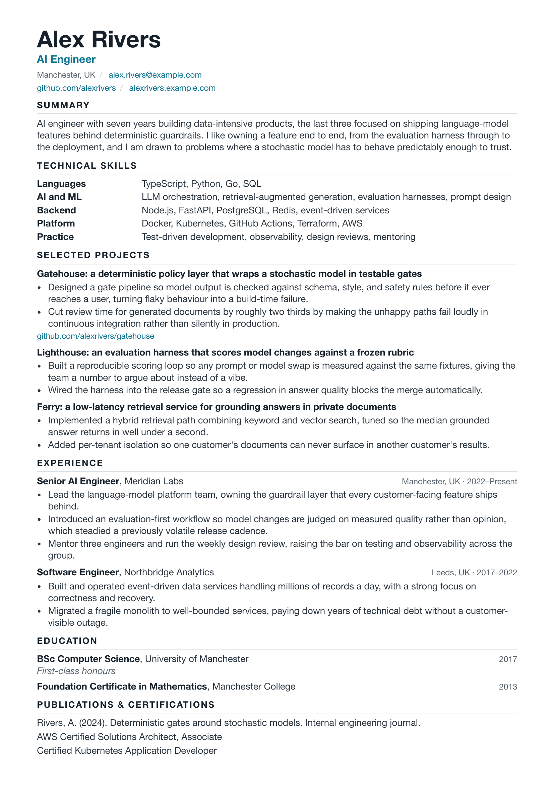

# tailored

**The model proposes; the gates decide.**

`tailored` turns a candidate's structured facts into a tailored CV and cover note
for a specific role. A stochastic language model writes the prose. A set of
deterministic gates stands between that prose and the document you send, so the
output is testable, repeatable, and free of the tells that give machine writing
away.

It ships as two things: a small TypeScript toolkit with a `tailored` CLI, and a
Claude Code skill that orchestrates the loop and calls the gates.

## The idea

A language model is a wonderful drafting tool and a terrible final authority. Left
alone it drifts: it invents an employer, it pads a date, it reaches for an em dash,
it lets a confidential project name slip into the prose. The fix is not a better
prompt. The fix is to wrap the stochastic component in deterministic checks that
fail the build, the same way a type checker wraps a dynamic language or a load
combination bounds a structural design. The model is free to be creative inside an
envelope it cannot leave.

This is an interlock for documents: a gate that lets good output through and stops
the rest, by construction rather than by hope.

## The gates

| Gate | What it enforces | Determinism |
| --- | --- | --- |
| schema | the candidate's `canon.yaml` is well formed | deterministic, exits non-zero on failure |
| fit | weighted candidate evidence against a frozen requirement map; hard blockers remain separate | deterministic |
| ATS vocabulary | literal employer terms present in the CV; never evidence of experience | deterministic |
| ai-tell | no em dashes, no double-hyphen connectors, no HTML em-dash entities | deterministic |
| page-fit | the document fits its page budget | deterministic, via poppler |
| ip-guard | no protected-topic leaks or canon-prohibited claims in the output | deterministic |
| claim-integrity | every rendered claim has exact, hashed evidence and authority | deterministic, via Chrome |
| visual | the document actually looks right | agent in the loop, read the preview |

Five of the six gates pass or fail with an exit code, so continuous integration
and the skill can both gate on them. The fifth is honest about its nature: judging
whether a page looks right is a job for a human or an agent reading the rendered
preview, not for a regular expression. We do not pretend otherwise.

### Claim-integrity contract

`tailored claim-integrity <html> --artifact <id> --canon canon.yaml --evidence evidence.yaml`
parses a declarative allowlist before execution, snapshots the hashed bytes, and
uses one print-media Chrome DevTools page for painted ownership plus
`Page.printToPDF`. The PDF text layer is supplemental. The explicitly named
`analyzeClaimIntegrityPreflight` API offers fast source diagnostics, but cannot
produce a final pass verdict.

Every visible authored text node must sit inside exactly one claim marker
(`data-claim-id`, `data-claim-subject`, and `data-claim-authority`) or one
strict decorative separator (`data-nonfactual-reason="decorative-separator"`
on a punctuation-only `span`). Arbitrary labels cannot turn factual prose into
decoration, and visible CSS `::before`/`::after` text is rejected. Evidence schema v2
binds the artifact path and SHA-256, exact claim text, candidate-canon or
archived employer/JD sources, and a combined binding digest. Structured metrics
state value, subject, unit, denominator, scale, and timeframe; write
`not-applicable` rather than omitting a dimension. This proves deterministic
binding and rendered coverage, not arbitrary semantic truth.

Authority is a closed pair: candidate claims use candidate facts; explicitly
employer-attributed claims use archived employer sources. The schema cannot
represent a mixed or third/public authority state, and employer evidence cannot
license first-person, possessive, reflexive, named-candidate or bare CV-fragment
claims.

To replay the gate over a private vault without printing its paths or contents,
build first and run `npm run replay:private -- /absolute/path/to/vault`. The
command inventories the consumed bytes, migrates and verifies temp copies, checks
for child mutation, then re-manifests the original vault and fails on any delta.
It emits only aggregate counts and one digest. A zero-artifact result proves
discovery ran, not that any pack passed.

### Complete-pack transaction

`tailored verify-pack pack.yaml candidate` is the
single publication boundary for a CV and cover pack. It copies declared HTML
into a hidden sibling staging directory, produces each exact PDF through the
same immutable Chrome snapshot inspected by `claim-integrity`, runs the
blocking and advisory gates, and exposes `candidate/` with one atomic rename.
The destination must not already exist. A blocker, missing Chrome or Poppler,
invalid advisory disposition, interrupted write, or concurrent losing writer
leaves no candidate directory.

The strict versioned policy must declare every required blocking and advisory
gate exactly once, with thresholds for fit, ATS, readability, and corpus
distinctness. The corpus descriptor owns each member's path, hash, and lifecycle
status; only approved/submitted members are eligible. Waivers and reviewer
attestations are typed, self-hashed, and scoped to one exact pack generation,
policy generation, advisory finding, and finding-content digest. A nested corpus
descriptor is traversed and bound recursively.

The JSON receipt binds the descriptor; canon; archived JD; frozen requirements
and baseline receipt; evidence; strategy, research, preferences, and policy;
source HTML and exact PDF/HTML outputs; corpus descriptor and every member;
waivers; reviewer attestations; and engine version/revision. Failed advisory
checks remain failed with an explicit disposition; they are never relabelled as
passes. Run `tailored verify-pack-fresh pack.yaml candidate` immediately before
human review to rehash the complete trust
surface, exact outputs, and current engine identity.

The receipt digest proves internal integrity, not provenance: anyone can hash
JSON. Runtime acceptance uses the opaque receipt returned by `verify-pack`; a
receipt reloaded or independently constructed from bytes can be checked for
freshness, but cannot be promoted as verifier-issued without re-running the
production verifier. The engine identity is derived from the executing Git
checkout or installed build digest, never supplied by a CLI flag.

## Install

```sh
git clone https://github.com/farshadpasbani/tailored
cd tailored
npm install
npm run build
npm test
```

To use the Claude Code skill, copy the `skill/` directory into your skills folder:

```sh
cp -r skill ~/.claude/skills/tailored
```

You will also want headless Chrome or Chromium for rendering and poppler for page
counting and previews. On macOS, `brew install poppler`. On Debian or Ubuntu,
`apt-get install poppler-utils chromium-browser`. Set `CHROME_BIN` if Chrome is
not at a standard path.

## Usage

Write your own `canon.yaml`: your single source of truth. It holds your identity,
summary, skills, projects, experience, education, and two things that make the
gates work: a `claims` block (what you can and cannot speak to) and a
`protectedTopics` list (terms that must never appear in any output). Keep this file
private. It is gitignored by default.

Validate it, then run the skill, which authors the documents and runs the gates:

```sh
tailored validate canon.yaml
tailored migrate-canon canon.yaml canon-v2.yaml
tailored migrate-requirements jd.yaml --jd-text job-description.md --frozen-at 2026-07-12T12:00:00.000Z --baseline-issuer reviewed-by-alex requirements.yaml
tailored issue-baseline-receipt requirements.yaml --jd-text job-description.md --issuer reviewed-by-alex baseline-receipt.yaml
tailored fit --requirements requirements.yaml --jd-text job-description.md --canon canon-v2.yaml --baseline-receipt baseline-receipt.yaml --allow-candidate-attested
tailored requirements-ats out/cv.pdf --requirements requirements.yaml --jd-text job-description.md --canon canon-v2.yaml --baseline-receipt baseline-receipt.yaml
tailored lint cv.html cover.html
tailored render cv.html out/cv.pdf
tailored page-fit out/cv.pdf --max 1
tailored ip-guard cv.html --canon canon.yaml --metric-claims metric-claims.yaml
tailored jd-pdf job-description.md out/job-description.pdf --title "Role" --company "Company"
```

`validate` reads legacy unversioned canons with an explicit warning during the
migration window. `migrate-canon` writes strict schemaVersion 2 YAML atomically,
refuses unmapped values, and can be rerun without changing its output.

Verified fit comes only from `requirements.yaml`: exact posting quotes and their
hard/preferred classification, bounded weight, eligibility impact, archive-sourced ATS literals,
source span, and direct/transferable fact IDs or explicit gaps are canonicalised
and frozen behind a baseline digest and a separately stored trusted freeze receipt. The requirements file contains only the receipt digest; it cannot mint its own trust anchor. Candidate
evidence names canon fact IDs. Changing CV wording can change the separate
ATS-vocabulary report, but cannot change fit. Post-freeze changes live in
`changes[]`; each requires a dated prior receipt supplied with `--receipt` that
hash-binds the baseline receipt, archived JD, requirement, action and exact
before/after state plus waiver approval. Candidate-attested facts award weight only with the explicit
`--allow-candidate-attested` policy; disputed, unverified, zero/low-confidence,
confidential, disallowed-provenance, or non-`fit` facts do not. `legacy-fit` and `ats --jd` remain available for
old `jd.yaml` workflows, but report keyword compatibility, not verified fit.

ATS authority uses only `ats.literals`, each with an exact archive span and
normalized literal match. Reviewed aliases/paraphrases are stored separately and
enter scoring only with `--include-ats-aliases`. A legacy keyword with no literal
or overlapping posting source is rejected from the authoritative map rather than
attached to an arbitrary requirement. Canon migration likewise never grants
`allowedUses: fit`; that permission is a separate per-fact review decision.

When a document contains numbers, `ip-guard` requires a persisted metric-claims
file. Every visible numeric occurrence maps to exactly one record. Metric records
bind a unique visible span to fact IDs and give its value, unit, subject, and
optional timeframe. Identity, date, and reference numbers use explicit exemption
records. Omitted, duplicate, ambiguous, or value-mismatched records block. A
number appearing somewhere in the canon is not enough: all four metric fields
must agree within one referenced fact.

Exemptions are grounded, not labels of convenience: an identity phone must equal
the canon phone, dates need complete ISO or human-readable date syntax, and
references need version/release/issue/PR/reference context. A bare year, `#999`
without reference context, or a phone-shaped event count remains a metric.
Canon-backed project, employment, education and publication years/ranges also
carry `sourcePaths` naming their exact canon fields; matching digits or nearby
employer names do not license a date exemption.

The matching HTML occurrence carries the same binding inside one exact canonical
owner entry. Bare years use a marked date field; ranges mark each endpoint in the
same metadata field. `ip-guard` asks Chrome for computed DOM visibility and the
rendered text, so hidden markers, hidden ancestors, moved markers and markers in
another entity cannot act as evidence. Marked fields and their ancestors need a
nonzero rendered box within the document page, nontransparent text, nonzero font
size, and no effective CSS clipping or off-page placement. If Chrome cannot
establish visibility, the gate fails closed. This is a computed-DOM boundary,
not screenshot/OCR proof of legibility or contrast against the background. These
attributes do not alter rendering.

```html
<div class="entry" data-canon-entry="projects[0]">
  <div class="title"><span class="project-name" data-canon-owner="projects[0].name">Gatehouse</span>: policy layer</div>
  <div class="meta" data-canon-source="projects[0].year">2024</div>
</div>
<div class="entry" data-canon-entry="experience[0]">
  <div><span class="title" data-canon-owner="experience[0].title">Senior AI Engineer</span>, <span class="org" data-canon-owner="experience[0].org">Meridian Labs</span></div>
  <div class="meta"><span data-canon-source="experience[0].start">2022</span>–<span data-canon-source="experience[0].end">Present</span></div>
</div>
```

```yaml
schemaVersion: 1
claims:
  - id: claim-audited-runs
    text: The release interlock completed 58 gate runs.
    factIds: [fact-release-interlock]
    value: 58
    unit: gate runs
    subject: release interlock
exemptions:
  - id: application-date
    text: 10 July 2026
    classification: date
```

The `jd-pdf` command renders a captured job posting to an archival PDF, so the
delivered folder keeps the CV, the cover note, and the role it was tailored to
side by side.

Or run the bundled example end to end:

```sh
tailored smoke
```

## Worked example: Alex Rivers

Alex Rivers is a fictional candidate. The example exists so the whole pipeline can
be demonstrated without anyone's real facts. The repo ships
`examples/alex-rivers/` with a complete `canon.yaml`, frozen `requirements.yaml`, a job description, and the
tailored `cv.html` and `cover.html` rendered against the house style.



Run the gates against it yourself:

```sh
node dist/cli.js validate examples/alex-rivers/canon.yaml
node dist/cli.js lint examples/alex-rivers/cv.html examples/alex-rivers/cover.html
node dist/cli.js smoke
```

## A note on the visual gate

Be clear-eyed about what is and is not automated. The schema, ai-tell, page-fit,
and ip-guard checks are deterministic: they run the same way every time and gate
the pipeline with an exit code. Whether the document looks good is a separate
question that a machine should not answer alone. A render can pass page-fit and
still carry a widow, a cramped header, or a section that breaks badly. The
pipeline rasterises the result so a human or an agent can read it and sign it off.
Automating the easy half and being honest about the hard half is the whole point.

## Your data never leaves your machine

The candidate's `canon.yaml` is private and gitignored. The gates run locally. The
rendered PDFs are gitignored too. The only thing this project ships publicly is the
fictional Alex Rivers example. Your real facts stay with you.

## Licence

MIT. See [LICENSE](LICENSE). Author: Farshad Pasbani.
